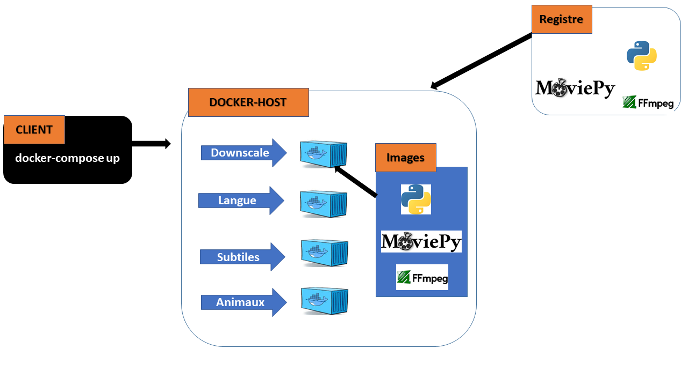
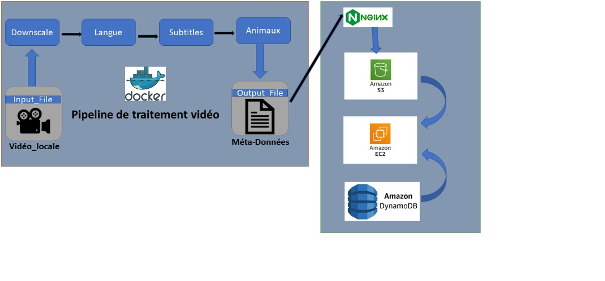

# VideoP:Pipeline hybride de traitement vidéo #
## Description du projet

VidP est un pipeline de traitement vidéo conçu pour automatiser le traitement, l'analyse et la gestion de vidéos à l'aide de conteneurs. Ce pipeline traite les vidéos en local pour générer des métadonnées, qui sont ensuite consolidées avec les vidéos originales dans le cloud. Les résultats sont accessibles publiquement via une page web.

Le pipeline est modulaire et repose sur plusieurs Pods (conteneurs) interconnectés pour exécuter différentes étapes du traitement vidéo. Fonctionnalités principales

## Architecture Composants principaux 

### Pipeline de traitement vidéo (en local) :
   **Downscale Pod** : Compression et redimensionnement des vidéos.
    
   **LangIdent Pod** : Détection de la langue parlée.

   **Subtitle Pod** : Génération de sous-titres.
   
   **Animal Detect Pod** : Détection et identification des animaux.

**Cloud**  :
    Les données sont traitées sur des instances EC2 avec un équilibreur de charge pour répartir les requêtes.
    Stockage des résultats dans Amazon S3 et DynamoDB.

**Interface utilisateur** :
    Une page web (hébergée sur NGINX) permet d'afficher les vidéos et métadonnées.

 **Résultats attendus**
    Les vidéos compressées, leurs métadonnées (langues, sous-titres, animaux détectés) et les originaux sont centralisés dans un espace de stockage sécurisé.
Une interface web conviviale permet d'accéder aux données traitées et de visualiser les vidéos.

## Partie1:Etapes d'exécution du pipeline dans Docker

 1-aller dans le dossier nommé **vidéos** et charger une vidéo qui a l'extension .mp4

 2-ensuite utilisé la commande **sudo docker compose up** pour démarrer les containers qui exécutera les scripts de façon automatique

 3-le contener pour le downscale va s'exécuter ,ensuite celui de la langue et des sous-titres vont suivre successivement

 4-le conteneur de la détection d'animaux n'est pas fonctionnel

 5-les résultats en sortis seront stocké dans un dossier appelé **data** qui est à la fois dans le container et dans notre machine

## Partie2:Amazon Web Services

1-aller dans le dossier ACCES_EC2,cliqué dessus et entrer le mot de passe(il vous sera fourni secrètement)

2-à l'intérieur vous trouver un fichier bash à exécuter ainsi la clé de l'intance

3-exécuter cette commande sur votre terminal:chmod +x run_test.sh

4-une fois que vous êtes connecté au serveur EC2 exécuter ceci:./run_tests.sh

5-Nettoyage : Après utilisation,  supprimer la clé privée et le script pour des raisons de sécurité :rm notreprojet.pem run_test.sh

